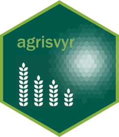

# agrisvyr

<!-- badges: start -->
<!-- badges: end -->


The goal of agrisvyr is to support the implementation of statistical disclosure control of microdata by providing functions to generate file, folder and reports, to generate and pre-populate R scripts and update anonymization reports

## Installation

`agrisvyr` is only available in github and You can install the current version of agrisvyr from [github](https://github.com/Amsata/agrisvyr) with:

``` r
library(remotes)
remotes::install_github("Amsata/agrisvyr")
```

## Example

Visit [the github page of agrisvyr](https://amsata.github.io/agrisvyr/index.html) for more information 

