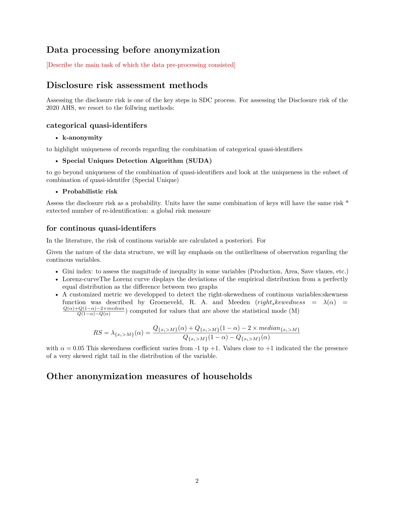

```{r, include = FALSE}
knitr::opts_chunk$set(
  collapse = TRUE,
  comment = "#>"
)
```

# Introduction

After the anonymization, it is always important to write a technical sdc report which highlight the different datasets anonymized, the sdc methods that have been applied using sdcMicro package and onther ad-hoc anonymization that have been applied as well.
The report should also include the analysis of SDC risk such as global risk, individual risk, SUDA risk, hierarchical risk (if applicable). In agricultural survey we may need to anonymized many dataset and writing the full report can be time consuming.

In the agrisvy package provide a template for the main report, and if a dataset is anonymized, main report can be appended with a simple R function in order to include the risk analysis and a comparison between the original risk and the final risk after SDC methods have been applied.

This article shows how to create and append the main SDC reports.

```{r setup}
library(agrisvyr)
```

# Create anonymization working folders and files

WHen creating the anonymization working folders and files, the `agrisvyr` package create a template of report saved in the forder dedicated to contain the anonymization report.

```{r}
agrisvy <- agrisvyr::createAgrisvy(
  svyName = "Anual Agricultural survey (AAS) 2020",
  author = "UBOS",
  language = "en",
  workingDir = "C:/Users/USER/OneDrive - Food and Agriculture Organization/agrisvyr_test/Uganda_2020/Anonymization",
  path = "C:/Users/USER/OneDrive - Food and Agriculture Organization/agrisvyr_test/Uganda_2020/2_Cleaned data",
  type = ".dta",
  varClassDir = "01_Variable classification",
  preProcScriptDir = "02_Pre-processing scripts",
  preprocDataDir = "03_Pre-processed data",
  anoScriptDir = "04_Anonymization scripts",
  anoDataDir = "05_Anonymized data",
  anoreportDir = "06_Anonymization report",
  fileDesDir = "07_Files description",
  infoLossReport = "08_Information loss report",
  tempfileDir = "09_Temporary_files",
  aobDir = "10_Miscellaneous"
)

```

```{r}
# agrisvyr::setup_anonymization(agrisvy,overwrite = TRUE)
```


```{r out.height = "600px", out.width='800px', echo=F}



```

The main template can be modified just by opening the rmarkdown document. After having anonymized a microdata, the main report need to be extended to integrate the risk analysis and  the sdc methods applied and the original/final risk comparison.

# Extending the sdc report


Let us anonymized the member dataset and extend the sdc report and see the output.

The initial anonymization setup has already generated anonymization scripts we can use directly. We will skip the pre-processing step and anonymize the clean data as it is.

```{r}
#'*|----------------------------------------------------------------------------|*
#'*|--| Anonymization of Anual Agricultural survey (AAS) 2020                   |*
#'*|--| Author: UBOS                                                            |*
#'*|--| Date: 2022-11-30                                                        |*
#'*|----------------------------------------------------------------------------|*
#'*|--| Dataset: Season 1=>PH=>SEC2_V1_MEMBERS.dta                              |*
#'*|----------------------------------------------------------------------------|*


rm(list = setdiff(ls(),"agrisvy"))

library(sdcMicro)
library(dplyr)
library(tidyr)
library(readxl)
library(haven)
library(questionr)
library(labelled)

purrr::walk(file.path("C:/Users/USER/OneDrive - Food and Agriculture Organization/agrisvyr_test/Uganda_2020/Anonymization/_R",
            list.files(path="C:/Users/USER/OneDrive - Food and Agriculture Organization/agrisvyr_test/Uganda_2020/Anonymization/_R",
            pattern = ".R$")),
            source)

sdcMessage("Season 1=>PH=>SEC2_V1_MEMBERS.dta")

#*****************************************************************
# Load microdata to be anonymized                                *
#*****************************************************************

inputdata=readMicrodata(path="03_Pre-processed data/Season 1/PH/SEC2_V1_MEMBERS_proc.dta",type="stata", convertCharToFac=FALSE, drop_all_missings=FALSE)
#*****************************************************************
# Load variable classification                                   *
#*****************************************************************
variable_classification=read_excel(path="01_Variable classification/Season 1_PH_VarClas.xlsx",
                                   sheet ="SEC2_V1_MEMBERS") %>% select(Name:Questions)

ano_variable=variable_classification %>% filter(Classification %in% c("Q","L")) %>% pull(Name)
ano_variable=ano_variable[!is.na(ano_variable)]
ano_variable

#*****************************************************************
# saving anonymized data                                         *
#*****************************************************************
write_dta(inputdata,"09_Temporary_files/temp_ano/Season 1/PH/SEC2_V1_MEMBERS_tmp.dta")


```

